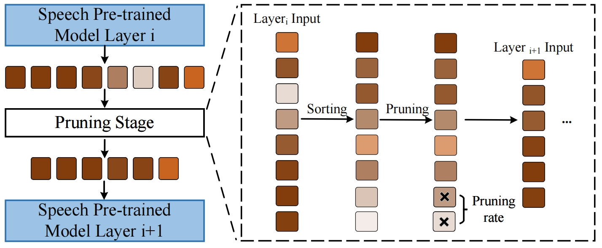

<h2 align="center">
Efficient Speech-to-Text Translation: Progressive Pruning for Accelerated Speech Pre-trained Model
</h2>

<p align="center">
  <!--  -->
  <!-- <under review></a> -->
  
  
</p>

<p align="center">
(Under review).
After the review period, we will open-source the code on our GitHub.
</p>

### Overview

<div style="text-align: center">

</div>
<!--  -->

### Key Implementation


- Calculate importance scores for all tokens `npy_tome_layer/models/hubert_transformer_encoder.py Line 1190`;
- Calculate the remaining tokens `npy_tome_layer/models/hubert_transformer_encoder.py Line 1192-1193`;
- Calculate the index of the remaining tokens `npy_tome_layer/models/hubert_transformer_encoder.py Line 1196-1198`;
- Use the torch.gather() function to extract all remaining tokens `npy_tome_layer/models/hubert_transformer_encoder.py Line 1199 `;


```

# x: (sequence_length, batch, features_embedding) 
# attn: (batch, sequence_length,sequence_length)

N, b, c = x.size()
attn = z

# calculate the import score
pruning_scores = attn.view(b, N, N).sum(dim=-1)

# calculate the left tokens
left_tokens = math.ceil(0.9 * (N)) #  N = token_num

x = x.transpose(0, 1)

# select import tokens
_, idx = torch.topk(pruning_scores, left_tokens, dim=1, largest=True, sorted=True) 
true_idx, _ = torch.topk(idx, left_tokens, dim=1, largest=False, sorted=True)  # [B, left_tokens] 
index = true_idx.unsqueeze(-1).expand(-1, -1, c)  # [B, left_tokens, C]          
x = torch.gather(x, dim=1, index=index)  # [B, left_tokens, C]  

x = x.transpose(0, 1)  

# MASK align
padding_mask = torch.gather(padding_mask, dim=1, index=true_idx)

```

### Installations

1. Create a conda environment with Pytorch and install fairseq

```
conda create --name pruning python=3.9
conda activate pruning
git clone https://github.com/pytorch/fairseq
cd fairseq
pip install --editable ./
python setup.py build develop

# if you meet the following error, please reinstall the packages

# numpy np.float error 
pip install numpy==1.23.5

# generation error: sacrebleu import error TOKENIZER 
pip install sacrebleu==1.5.1
```


This repository is constructed using the codebase from fairseq. If you require information on the basic usage of fairseq, please refer to the [fairseq documentation](https://fairseq.readthedocs.io/en/latest/).

2. Requirements

- pandas==2.0.3
- sacrebleu==1.5.1
- scikit-learn==1.3.0
- scipy==1.11.1
- sentencepiece==0.1.99
- tensorboard==2.14.0
- torch==2.0.1
- torchaudio==2.0.2
- tqdm==4.65.0


### Datasets and Models


<!-- #### Mustc v1 -->
#### Mustc Datasets Prepare

Please Download [Mustc-v1](https://docs.google.com/forms/d/e/1FAIpQLSer9jNfUtxbi610n3T6diXRlANBbuzShsCje-GtKs1Sngh0YQ/viewform?pli=1) datasets. 

   *Notes: It appears that the original dataset [website](https://www.fbk.eu/en/research-centers/) hides the download link. However the dataset can still be downloaded after filling out the dataset request [form](https://docs.google.com/forms/d/e/1FAIpQLSer9jNfUtxbi610n3T6diXRlANBbuzShsCje-GtKs1Sngh0YQ/viewform?pli=1) directly. So we recommend that you use this method.*

2. Make directories to store ST (MuST-C) and datasets. Please specify the target language.


#### Deltalm Prepare
1.  Download [Vocabulary](https://deltalm.blob.core.windows.net/deltalm/dict.txt), [ Sentencepiece-model](https://deltalm.blob.core.windows.net/deltalm/spm.model) and [Model](https://deltalm.blob.core.windows.net/deltalm/deltalm-base.pt) of deltalm and you need to tokenize raw data to spm data. 

2.  Preprocess spm data. 

#### Speech Pre-trained Model 

1. We use Hubert model for speech pre-trained model for training. Before training, please download the [HuBERT-Base](https://dl.fbaipublicfiles.com/hubert/hubert_base_ls960.pt) model.


### Acknowledgment

We refer to the code of [Deltalm](https://github.com/microsoft/unilm/tree/master/deltalm). Thanks for their great contributions!