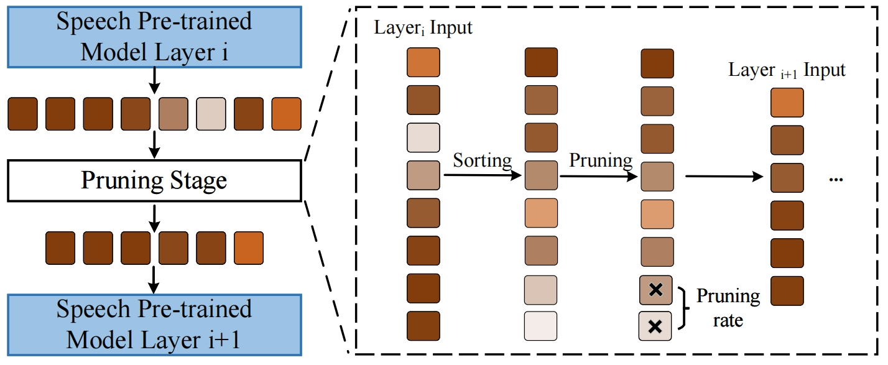
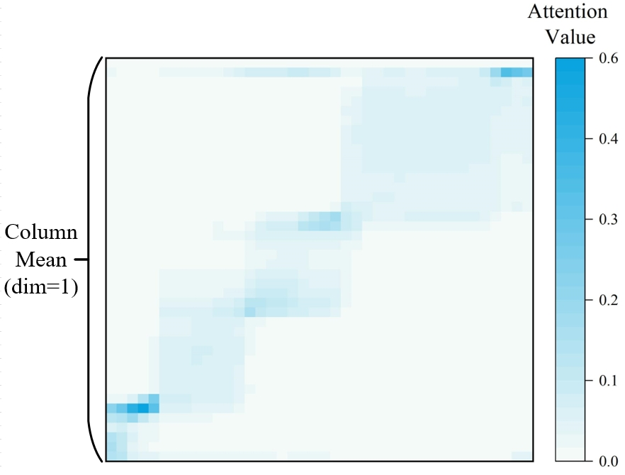
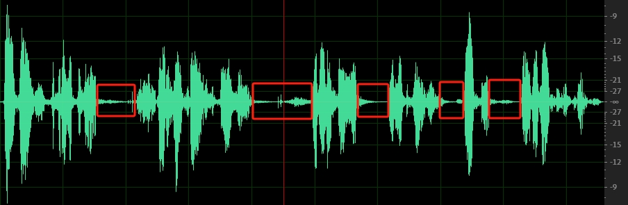
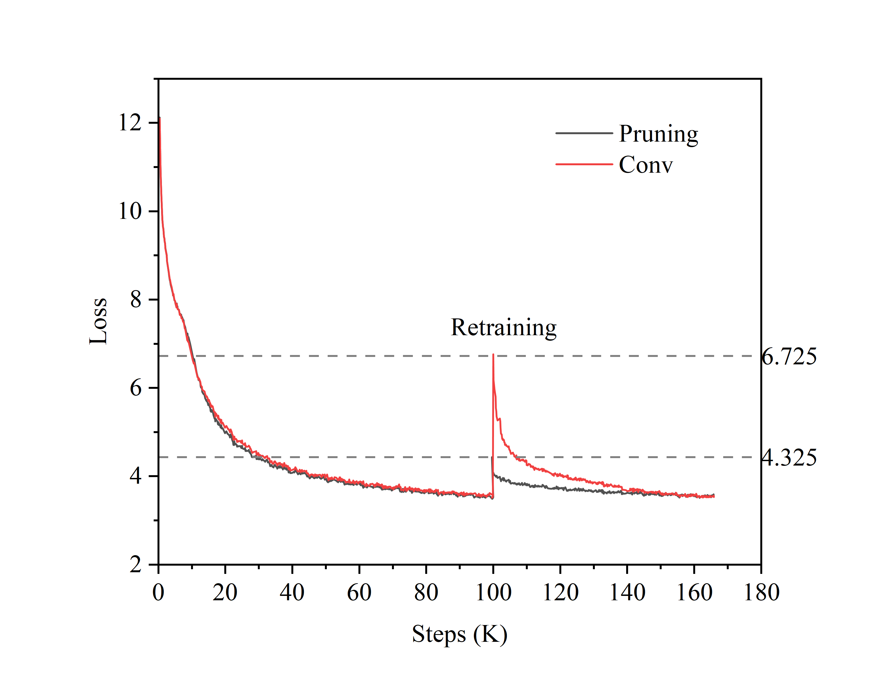

<h2 align="center">
Efficient Speech-to-Text Translation: Progressive Pruning for Accelerated Speech Pre-trained Model
</h2>

<p align="center">
  <!--  -->
  <!-- <under review></a> -->
  
  
</p>

<p align="center">
(Under review).
After the review period, we will open-source the code on our GitHub.
</p>

### Overview

<div style="text-align: center">

</div>


### Calculate Importances Scores

<div style="text-align: center">

</div>

### Key Implementations


- Calculate importance scores for all tokens `npy_tome_layer/models/hubert_transformer_encoder.py Line 1190`;
- Calculate the remaining tokens `npy_tome_layer/models/hubert_transformer_encoder.py Line 1192`;
- Calculate the index of the remaining tokens `npy_tome_layer/models/hubert_transformer_encoder.py Line 1196-1198`;
- Use the torch.gather() function to extract all remaining tokens `npy_tome_layer/models/hubert_transformer_encoder.py Line 1199 `;


#### Core Codes
```
# x: (sequence_length, batch, features_embedding) 
# attn: (batch, sequence_length,sequence_length)

if i >= self.pruning_init_layer:
    N, b, c = x.size()
    attn = z
    # calculate the importance scores
    pruning_scores = attn.view(b, N, N).sum(dim=1)

    # calculate the left tokens
    left_tokens = math.ceil(self.pruning_rate * (N)) #  N = token_num

    x = x.transpose(0, 1)
    # select importance tokens
    test, idx = torch.topk(pruning_scores, left_tokens, dim=1, largest=True, sorted=True)  # [B, left_tokens]
    true_idx, _ = torch.topk(idx, left_tokens, dim=1, largest=False, sorted=True)  # [B, left_tokens] 
    index = true_idx.unsqueeze(-1).expand(-1, -1, c)  # [B, left_tokens, C]          
    x = torch.gather(x, dim=1, index=index)  # [B, left_tokens, C]  

    x = x.transpose(0, 1)  
    # MASK align
    padding_mask = torch.gather(padding_mask, dim=1, index=true_idx)
```

### More Analysis

#### Q1: Why use token pruning rather than token merging? 

[Table 1](./figures/table.md) presents the specific numerical values for the visualization of Fig. 3 in the paper. It can be observed that the attention scores between many tokens in the table are 0, indicating that there is no mutual influence between some tokens. Furthermore, merging tokens consumes additional time; therefore, our proposed method uses token pruning rather than token merging.


#### Q2: Why not pruning based on a threshold?
If a threshold is used, it will result in different numbers of tokens being pruned for each input sequence, rendering the model unable to batch process. If we employ a MASK matrix to mask the pruning tokens, however, it contradicts the original intention of model acceleration.

#### Q3: Why set a pruning rate instead of a fixed pruning number?
The differences in patch length for various image inputs are not significant. For example, most images fed into pre-training models have both H and W dimensions set to 224, corresponding to a patch length of 588 (3 × 224 × 224 // 16 ×16). Therefore, a fixed number of tokens can be gradually clipped in the field of CV.

However, the token length for different speech inputs varies significantly. Additionally, the length of speech sequences is much longer than that of corresponding text sequences. Therefore, we use a pruning rate to ensure that longer speech inputs prune more tokens, and shorter ones prune fewer tokens.

### Speech Information Redundancy

<div style="text-align: center">

</div>

Visualization of input audio, the corresponding audio file is in ```audio/ted_1096_7.wav```. From the red boxes of this figure, it can be observed that there is a lot of redundant information in the content of the speech input.

### Loss Curve of Retraining
The loss curve of retraining, "Conv" represents the utilization of the convolution module. Both pruning and convolution techniques are applied to the sixth layer of the speech pre-trained model.
<div style="text-align: center">

</div>

### Installations

Create a conda environment with Pytorch and install fairseq

```
conda create --name pruning python=3.9
conda activate pruning
git clone https://github.com/pytorch/fairseq
cd fairseq
pip install --editable ./
python setup.py build develop

# if you meet the following error, please reinstall the packages
# numpy np.float error 
pip install numpy==1.23.5

# generation error: sacrebleu import error TOKENIZER 
pip install sacrebleu==1.5.1
```


This repository is constructed using the codebase from [fairseq](https://github.com/facebookresearch/fairseq). If you require information on the basic usage of fairseq, please refer to the [fairseq documentation](https://fairseq.readthedocs.io/en/latest/).

Requirements
- pandas==2.0.3
- sacrebleu==1.5.1
- scikit-learn==1.3.0
- scipy==1.11.1
- sentencepiece==0.1.99
- tensorboard==2.14.0
- torch==2.0.1
- torchaudio==2.0.2
- tqdm==4.65.0


### Datasets and Models
#### MuST-C Datasets Prepare

Please Download [MuST-C-v1](https://docs.google.com/forms/d/e/1FAIpQLSer9jNfUtxbi610n3T6diXRlANBbuzShsCje-GtKs1Sngh0YQ/viewform?pli=1) datasets. 

   *Notes: It appears that the original dataset [website](https://www.fbk.eu/en/research-centers/) hides the download link. However, the dataset can still be downloaded after filling out the dataset request [form](https://docs.google.com/forms/d/e/1FAIpQLSer9jNfUtxbi610n3T6diXRlANBbuzShsCje-GtKs1Sngh0YQ/viewform?pli=1) directly. So we recommend that you use this method.*

1. Make directories to store ST (MuST-C) and datasets. Please specify the target language.

2.  Preprocess spm data. 

#### Speech Pre-trained Model 

We use HuBERT model for speech pre-trained model for training. Before training, please download the [HuBERT-Base](https://dl.fbaipublicfiles.com/hubert/hubert_base_ls960.pt) model.


#### Speech-to-text Translation Training

#### Regular Training Baselines
```
export CUDA_VISIBLE_DEVICES=1
target=de
SAVE_DIR=/workspace/s2t/deltalm_data/save_dir/$target/model_baselines

data_dir=/workspace/s2t/data/en_de
# TEXT_DIR=/workspace/s2t/deltalm_data/en-$target/binary
TEXT_DIR=/workspace/s2t/npy_st/mt_data_bin/en-$target/en-$target/binary
USER_DIR=/workspace/tome/npy_tome_test

HU_BERT=/workspace/s2t/npy_st/pretrained_model_save/hubert/hubert_base_ls960.pt
MT_PRETRAINED_MODEL=/workspace/s2t/npy_st/pretrained_model_save/mt_model_save/mt.en-de.base.pt


fairseq-train $data_dir --text-data $TEXT_DIR --tgt-lang $target \
  --user-dir $USER_DIR \
  --config-yaml config_hyper.yaml --train-subset train --valid-subset dev \
  --save-dir $SAVE_DIR --num-workers 4 --max-tokens 3000000 --batch-size 32 --max-tokens-text 8192 \
  --task speech_and_text_translation --criterion speech_and_text_translation --label-smoothing 0.1 \
  --arch hubert_transformer_pruning_layer --optimizer adam --adam-betas '(0.9, 0.98)' --lr 1e-4 --lr-scheduler inverse_sqrt --weight-decay 0.0001 \
  --ddp-backend=legacy_ddp \
  --warmup-updates 4000 --clip-norm 0.0 --seed 1 --update-freq 2 \
  --layernorm-embedding \
  --max-epoch 45 \
  --fp16 \
  --st-training --mt-finetune \
  --st-training \
  --hubert-model-path $HU_BERT \
  --load-pretrained-mt-encoder-decoder-from $MT_PRETRAINED_MODEL --tensorboard-logdir $SAVE_DIR
```


##### Pruning (Fixed Pruning Rate)

```
# key args --pruning-rate --pruning-init-layer

export CUDA_VISIBLE_DEVICES=1
target=de
SAVE_DIR=/workspace/s2t/deltalm_data/save_dir/$target/pruning_layer_rate_085_layer6


data_dir=/workspace/s2t/data/en_de
# TEXT_DIR=/workspace/s2t/deltalm_data/en-$target/binary
TEXT_DIR=/workspace/s2t/npy_st/mt_data_bin/en-$target/en-$target/binary
USER_DIR=/workspace/tome/npy_tome_layer

HU_BERT=/workspace/s2t/npy_st/pretrained_model_save/hubert/hubert_base_ls960.pt
MT_PRETRAINED_MODEL=/workspace/s2t/npy_st/pretrained_model_save/mt_model_save/mt.en-de.base.pt


fairseq-train $data_dir --text-data $TEXT_DIR --tgt-lang $target \
  --user-dir $USER_DIR \
  --config-yaml config_hyper.yaml --train-subset train --valid-subset dev \
  --save-dir $SAVE_DIR --num-workers 4 --max-tokens 3000000 --batch-size 32 --max-tokens-text 8192 \
  --task speech_and_text_translation --criterion speech_and_text_translation --label-smoothing 0.1 \
  --arch hubert_transformer_pruning_layer --optimizer adam --adam-betas '(0.9, 0.98)' --lr 1e-4 --lr-scheduler inverse_sqrt --weight-decay 0.0001 \
  --ddp-backend=legacy_ddp \
  --warmup-updates 4000 --clip-norm 0.0 --seed 1 --update-freq 2 \
  --layernorm-embedding \
  --max-epoch 45 \
  --fp16 \
  --st-training --mt-finetune \
  --st-training \
  --hubert-model-path $HU_BERT \
  --load-pretrained-mt-encoder-decoder-from $MT_PRETRAINED_MODEL --tensorboard-logdir $SAVE_DIR --pruning-rate 0.999 --pruning-init-layer 4
```

#### Pruning (Schedule Pruning Rate)

```
# key args --pruning-max-rate --pruning-min-rate --pruning-init-layer --arch

export CUDA_VISIBLE_DEVICES=1
target=de
SAVE_DIR=/workspace/s2t/deltalm_data/save_dir/$target/pruning_layer_rate_085_layer6


data_dir=/workspace/s2t/data/en_de
# TEXT_DIR=/workspace/s2t/deltalm_data/en-$target/binary
TEXT_DIR=/workspace/s2t/npy_st/mt_data_bin/en-$target/en-$target/binary
USER_DIR=/workspace/tome/npy_tome_layer

HU_BERT=/workspace/s2t/npy_st/pretrained_model_save/hubert/hubert_base_ls960.pt
MT_PRETRAINED_MODEL=/workspace/s2t/npy_st/pretrained_model_save/mt_model_save/mt.en-de.base.pt


fairseq-train $data_dir --text-data $TEXT_DIR --tgt-lang $target \
  --user-dir $USER_DIR \
  --config-yaml config_hyper.yaml --train-subset train --valid-subset dev \
  --save-dir $SAVE_DIR --num-workers 4 --max-tokens 3000000 --batch-size 32 --max-tokens-text 8192 \
  --task speech_and_text_translation --criterion speech_and_text_translation --label-smoothing 0.1 \
  --arch hubert_transformer_pruning_layer_schedule --optimizer adam --adam-betas '(0.9, 0.98)' --lr 1e-4 --lr-scheduler inverse_sqrt --weight-decay 0.0001 \
  --ddp-backend=legacy_ddp \
  --warmup-updates 4000 --clip-norm 0.0 --seed 1 --update-freq 2 \
  --layernorm-embedding \
  --max-epoch 45 \
  --fp16 \
  --st-training --mt-finetune \
  --st-training \
  --hubert-model-path $HU_BERT \
  --load-pretrained-mt-encoder-decoder-from $MT_PRETRAINED_MODEL --tensorboard-logdir $SAVE_DIR --pruning-rate 0.999 --pruning-init-layer 4
```


### Acknowledgment

We refer to the code of [Hubert](https://github.com/facebookresearch/fairseq/blob/main/examples/hubert/README.md). Thanks for their great contributions!